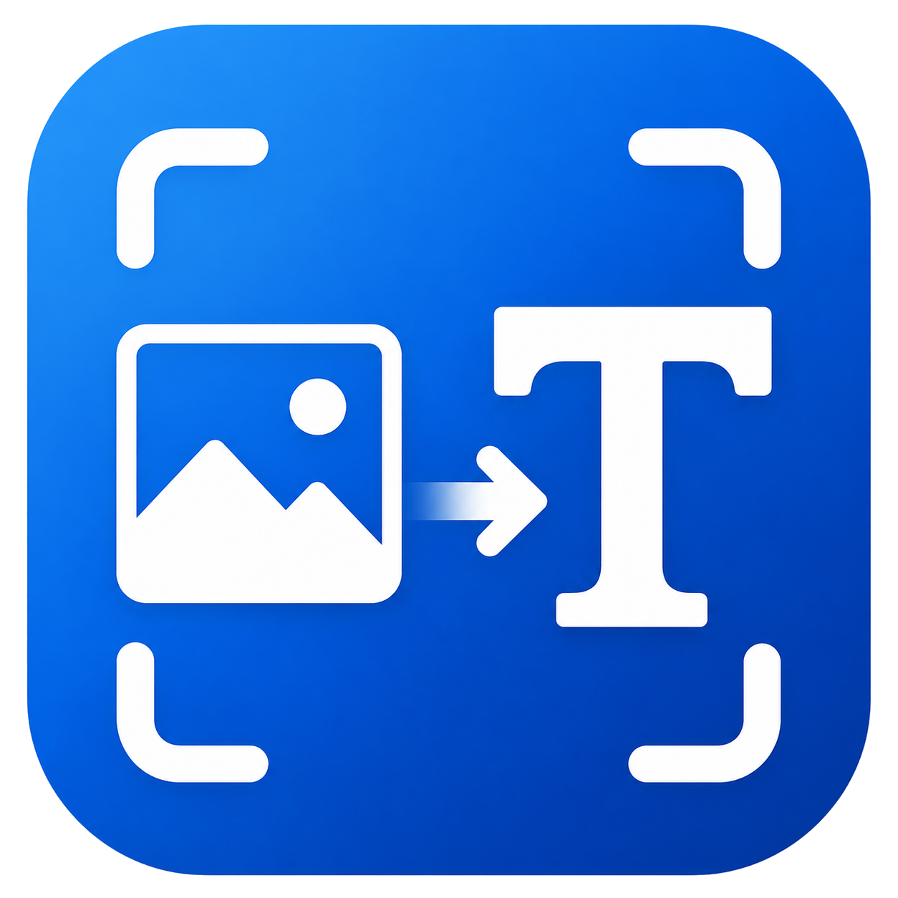

<div align="center">



# ScreenTextCopy

**التقط النص من أي مكان على شاشة Windows — ثم انسخه أو ترجمه أو أرسله إلى هاتفك.**

نوافذ أخطاء لا تسمح لك بتحديد نصها. نص محفور داخل صورة. ترجمة مدمجة في مقطع فيديو.
قارئ PDF يقاومك. يقرأ ScreenTextCopy كل ذلك، محليًا على جهازك.

[](https://github.com/rezakazemifathi/ScreenTextCopy/actions/workflows/build.yml)
[](https://github.com/rezakazemifathi/ScreenTextCopy/releases/latest)
[](https://github.com/rezakazemifathi/ScreenTextCopy/releases)
[](LICENSE)
[](https://dotnet.microsoft.com/)
[](#المتطلبات)

[English](README.md) · [فارسی](README.fa.md) · **العربية**

### [⬇️ تنزيل برنامج التثبيت](https://github.com/rezakazemifathi/ScreenTextCopy/releases/latest)

بلا متطلبات مسبقة. بلا تثبيت .NET. بلا تثبيت Tesseract. ملف واحد ونقرة واحدة.

</div>

---

<div align="right">

## جدول المحتويات

- [لماذا هذا البرنامج](#لماذا-هذا-البرنامج)
- [المزايا](#المزايا)
- [التثبيت](#التثبيت)
- [البداية السريعة](#البداية-السريعة)
- [مزودو الترجمة](#مزودو-الترجمة)
- [الشبكة والبروكسي](#الشبكة-والبروكسي)
- [الخصوصية](#الخصوصية)
- [المتطلبات](#المتطلبات)
- [البناء من المصدر](#البناء-من-المصدر)
- [التوثيق](#التوثيق)
- [حل المشكلات](#حل-المشكلات)
- [المساهمة](#المساهمة)
- [الترخيص](#الترخيص)
- [المؤلف والدعم](#المؤلف-والدعم)

</div>

---

<div align="right">

## لماذا هذا البرنامج

يزخر نظام Windows بنصوص لا يمكنك نسخها: رسالة خطأ من برنامج تثبيت تحتاج إلى البحث
عنها، فاتورة ممسوحة ضوئيًا، لقطة شاشة أرسلها إليك زميل، حوار في لعبة بلغة لا
تقرأها. والجواب المعتاد هو «أعد كتابته يدويًا».

يستبدل ScreenTextCopy ذلك بضغطة زر: اضغط `Ctrl + Shift + X`، واسحب مستطيلًا،
فيصبح النص في الحافظة فورًا — بعد التعرّف عليه **على جهازك أنت**، دون أن تخرج أي
لقطة شاشة منه.

## المزايا

| | |
|---|---|
| 🖱️ **التقاط أي شيء** | اسحب مستطيلًا فوق أي جزء من أي نافذة، بأي كثافة نقاط (DPI)، وعلى أي شاشة. |
| 🔒 **تعرّف ضوئي محلي** | يأتي Tesseract 5 مدمجًا داخل التطبيق. لا تلمس لقطات الشاشة الشبكة أبدًا. |
| 📋 **نسخ تلقائي** | يصل النص المتعرَّف عليه إلى الحافظة لحظة انتهاء عملية OCR. |
| 🌍 **14 لغة للتعرّف الضوئي** | الإنجليزية والفارسية والعربية مدمجة؛ والفرنسية والألمانية والإسبانية والإيطالية والروسية والتركية والصينية واليابانية والكورية والهندية والبرتغالية قابلة للتثبيت من الإعدادات مع شريط تقدّم. |
| 🔤 **الكتابات المختلطة** | يُتعرَّف على الفارسية والإنجليزية في سطر واحد دون تشويش، مع معالجة صحيحة لاتجاهي RTL و LTR. |
| 🈯 **الترجمة إلى 14 لغة** | المزوّد المجاني لا يحتاج أي مفتاح على الإطلاق، أو أوصِل **أي** نقطة نهاية متوافقة مع OpenAI. |
| 🎮 **وضع الترجمة في المكان** | يترجم `Ctrl + Shift + Z` منطقة من الشاشة داخل نافذة عائمة مثبَّتة بجانبها — مصمَّم للألعاب ومقاطع الفيديو والترجمات. |
| 🔁 **تبديل تلقائي بين النماذج** | إذا انتهت مهلة أحد النماذج، يُجرَّب النموذج التالي المعروف تلقائيًا. |
| 🌐 **مراعاة البروكسي** | بروكسي النظام، أو اتصال مباشر قسري، أو بروكسي يدوي `http` / `https` / `socks4` / `socks5` — قابل للتبديل أثناء التشغيل. |
| 📱 **الإرسال إلى الهاتف** | رمز QR يُولَّد محليًا. لا حساب ولا خادم ولا رفع. |
| ⌨️ **اختصارات عامة قابلة لإعادة التعيين** | كلا الاختصارين قابل للتهيئة ويعمل بينما التطبيق مخفي في شريط النظام. |
| 🎨 **سمتان داكنة وفاتحة حقيقيتان** | تتبع نظام Windows افتراضيًا، مع تباين سليم في الحالتين. |
| 🇬🇧 🇮🇷 **واجهة ثنائية اللغة** | تبديل فوري بين الإنجليزية والفارسية بتخطيط كامل من اليمين إلى اليسار وخط Vazirmatn المدمج. |
| 🪟 **مقيم في شريط النظام** | إغلاق النافذة يُبقيه على بُعد ضغطة زر واحدة بدلًا من إنهائه. |

## التثبيت

### الطريقة المُوصى بها — برنامج التثبيت

1. نزِّل الملف **`ScreenTextCopy-Setup-<version>-win-x64.exe`** من
   [أحدث إصدار](https://github.com/rezakazemifathi/ScreenTextCopy/releases/latest).
2. شغِّله. قد يحذّرك Windows SmartScreen من أن الناشر غير معروف لأن النسخة غير
   موقَّعة رقميًا — اختر **More info → Run anyway**.
3. أكمل خطوات المعالج. يمكنك اختياريًا تحديد *desktop shortcut* و *start with Windows*.

**لا شيء آخر يحتاج إلى تثبيت.** فبيئة تشغيل .NET 8 ومحرك التعرّف الضوئي Tesseract
موجودان داخل الحزمة. ولا حاجة إلى كلمة مرور المسؤول: يُثبَّت التطبيق لكل مستخدم على
حدة تحت `%LocalAppData%\Programs\ScreenTextCopy`.

### بديل — النسخة المحمولة

نزِّل `ScreenTextCopy-<version>-win-x64-portable.zip`، وفكّ ضغطه في أي مكان (بما في
ذلك ذاكرة USB)، ثم شغِّل `ScreenTextCopy.exe`. لا يُكتب شيء خارج المجلد سوى
إعداداتك في `%AppData%\ScreenTextCopy`.

</div>

> تحقّق من صحة ما نزّلته باستخدام `SHA256SUMS.txt`:
> `Get-FileHash .\ScreenTextCopy-Setup-2.0.0-win-x64.exe -Algorithm SHA256`

<div align="right">

تعليمات كاملة مع لقطات شاشة خطوةً بخطوة: **[docs/INSTALL.md](docs/INSTALL.md)**
· **[راهنمای فارسی](docs/INSTALL.fa.md)**

</div>

<div align="right">

## البداية السريعة

1. اضغط **`Ctrl + Shift + X`** — تعتم الشاشة ويتحول المؤشر إلى شعيرات تصويب.
2. **اسحب** مستطيلًا حول النص.
3. **أفلِت الزر.** يعمل التعرّف الضوئي محليًا؛ فيظهر النص في النافذة ويكون قد نُسخ بالفعل.
4. اختياريًا اختر لغة الهدف واضغط **Translate**، أو **Send to phone**.

للألعاب ومقاطع الفيديو، اضغط **`Ctrl + Shift + Z`** بدلًا من ذلك: تظهر الترجمة في
لوحة عائمة صغيرة بجانب ما حدّدته، مع زر **Retry** لإعادة المحاولة.

كل شيء — السمة، ولغة الواجهة، ولغات التعرّف الضوئي، والاختصاران، ومزوّد الترجمة،
والبروكسي — موجود في **Settings**.

المزيد: **[docs/USAGE.md](docs/USAGE.md)** · **[راهنمای استفاده](docs/USAGE.fa.md)**

## مزودو الترجمة

| | المجاني | الذكاء الاصطناعي المخصص |
|---|---|---|
| مفتاح API | غير مطلوب | مفتاحك أنت |
| الخلفية | MyMemory | أي `/chat/completions` متوافق مع OpenAI |
| يعمل مع | — | OpenAI، OpenRouter، Groq، DeepSeek، Together، Azure OpenAI، Ollama، LM Studio، vLLM، … |
| الجودة | مناسب للنصوص القصيرة | أفضل بكثير، خصوصًا مع التعبيرات الاصطلاحية والنصوص الطويلة |
| منتقي النماذج | — | يُكتشف تلقائيًا من مسار `/models` لدى المزوّد |

في المزوّد المخصص تُدخل **عنوان URL الأساسي** (مثل `https://api.openai.com/v1`)،
و**مفتاح API** اختياريًا، و**اسم النموذج**. اضغط **Test connection** فيُبلِّغك
التطبيق بإمكانية الوصول، وزمن الاستجابة، وعدد النماذج التي وجدها؛ ثم تُملأ قائمة
النماذج تلقائيًا ويُحفظ اختيارك بين مرات التشغيل.

اترك خيار **«الانتقال تلقائيًا إلى نموذج آخر عند انتهاء مهلة أحدها»** مُفعَّلًا، فلن
يعني تعطّل نموذج فشلَ الترجمة — إذ يُجرَّب النموذج التالي المعروف بدلًا منه. أمّا
أخطاء المصادقة (401/403) فلا تُطلِق التبديل أبدًا، لأن إعادة تجربة مفتاح غير صالح على
عشرة نماذج تعني إهدار عشرة طلبات.

> مفتاح API الخاص بك مُخزَّن **فقط** في `%AppData%\ScreenTextCopy\settings.json` على
> حاسوبك أنت. ولا يُسجَّل في السجلات أبدًا، ولا يظهر في رسائل الأخطاء، ولا يُرسل إلى
> أي مكان غير نقطة النهاية التي هيّأتها.

## الشبكة والبروكسي

كثير من نقاط نهاية الذكاء الاصطناعي غير قابلة للوصول من بعض المناطق، وبروكسي نظام
Windows القديم غير العامل هو السبب الأول الأكثر شيوعًا لرسالة *"No connection could be
made because the target machine actively refused it"*. ويمنحك المسار
**Settings → Translation → Network** ثلاثة خيارات صريحة:

| الوضع | ما يفعله |
|---|---|
| **System proxy** (الافتراضي) | يستخدم بروكسي Windows، مثل متصفحك. |
| **Direct** | يتجاهل بروكسي النظام تمامًا — وهو الحل عندما يكون هناك بروكسي معطّل مُهيَّأ على مستوى النظام. |
| **Manual** | يوجّه الاتصال عبر عنوان تكتبه أنت، مثل `socks5://127.0.0.1:10808` (الافتراضي في v2rayN/Xray) أو `http://127.0.0.1:10809`. |

تُقرأ هذه الإعدادات مع كل طلب، لذا تصبح سارية لحظة الحفظ — دون حاجة إلى إعادة التشغيل.

## الخصوصية

> ما يظهر على شاشتك يبقى على جهازك.

- **التعرّف الضوئي محلي 100%.** ويُحذف ملف PNG المؤقت الخاص بالالتقاط داخل كتلة `finally`.
- **«الإرسال إلى الهاتف»** يرسم رمز QR محليًا؛ ولا يُرفع أي شيء.
- **لا تتبّع ولا تحليلات ولا حسابات ولا استدعاءات تحديث تلقائي.**
- البايتات **الوحيدة** التي تخرج من حاسوبك هي (أ) النص الذي تطلب ترجمته صراحةً،
  ويُرسل فقط إلى المزوّد الذي اخترته، و(ب) حِزم لغات التعرّف الضوئي التي تطلب
  تثبيتها، وتُجلب عبر HTTPS من المستودع الرسمي
  [`tesseract-ocr/tessdata_fast`](https://github.com/tesseract-ocr/tessdata_fast).

## المتطلبات

**للتشغيل:** Windows 10 (1809+) أو Windows 11، بمعمارية 64 بت. لا شيء غير ذلك — فنسخة
الإصدار تحمل معها بيئة تشغيل .NET ومحرك التعرّف الضوئي.

**للبناء:** [.NET 8 SDK](https://dotnet.microsoft.com/download/dotnet/8.0)،
بالإضافة إلى [Inno Setup 6](https://jrsoftware.org/isdl.php) فقط إن أردت إنتاج
برنامج التثبيت.

## البناء من المصدر

</div>

```powershell
git clone https://github.com/rezakazemifathi/ScreenTextCopy.git
cd ScreenTextCopy

# لمرة واحدة: ضع محرك Tesseract في مكانه (انظر الملاحظة أدناه).
powershell -ExecutionPolicy Bypass -File scripts\fetch-tesseract.ps1

dotnet run --project src\ScreenTextCopy\ScreenTextCopy.csproj
```

<div align="right">

> **لماذا ليس Tesseract داخل المستودع؟** لأن أحد ملفاته الثنائية،
> `libtesseract-5.dll`، يبلغ نحو 106 ميغابايت — أي أكبر من حد GitHub الصارم البالغ
> 100 ميغابايت للملف الواحد. وإيداعه سيجعل استنساخ المستودع متعذّرًا على كثير من
> الناس. والسكربت `fetch-tesseract.ps1` يعيد استخدام نسخة Tesseract مثبّتة لديك،
> ويعرض تثبيت واحدة عبر `winget`، وينزّل بيانات اللغات. أمّا نسخ الإصدارات الجاهزة
> فتحتوي على كل شيء مسبقًا.

### إنتاج ملفات الإصدار

</div>

```powershell
powershell -ExecutionPolicy Bypass -File scripts\build-release.ps1 -Version 2.0.0
```

<div align="right">

ويكتب ذلك داخل المجلد `release\`:

| الملف | ما هو |
|---|---|
| `app\` | التطبيق المنشور المكتفي بذاته |
| `ScreenTextCopy-2.0.0-win-x64-portable.zip` | نسخة فكّ الضغط والتشغيل |
| `ScreenTextCopy-Setup-2.0.0-win-x64.exe` | برنامج التثبيت بنقرة واحدة |
| `SHA256SUMS.txt` | المجاميع الاختبارية لكل ما سبق |

التفاصيل وملاحظات التصميم: **[docs/BUILD.md](docs/BUILD.md)**.

## التوثيق

| المستند | |
|---|---|
| [دليل التثبيت](docs/INSTALL.md) · [فارسی](docs/INSTALL.fa.md) | خطوة بخطوة، من التنزيل إلى أول عملية التقاط |
| [دليل الاستخدام](docs/USAGE.md) · [فارسی](docs/USAGE.fa.md) | شرح كل ميزة وكل إعداد |
| [حل المشكلات](docs/TROUBLESHOOTING.md) · [فارسی](docs/TROUBLESHOOTING.fa.md) | حلول عملية للأخطاء التي يواجهها الناس فعلًا |
| [دليل البناء](docs/BUILD.md) | البناء والنشر والتحزيم |
| [البنية](docs/architecture.md) | كيف تتلاءم الأجزاء معًا |
| [خريطة المصدر](docs/source-map.md) | ما يوجد في كل ملف |
| [التطوير](docs/development.md) | الأعراف وسير العمل |
| [النشر على GitHub](docs/PUBLISH-TO-GITHUB.fa.md) | شرح تفصيلي لـ Git/GitHub (بالفارسية) |
| [سجل التغييرات](CHANGELOG.md) | ما تغيّر ومتى |

## حل المشكلات

أكثر ثلاث مشكلات تُبلَّغ عنها:

| العَرَض | الحل |
|---|---|
| *"target machine actively refused it (127.0.0.1:10808)"* | بروكسي نظام معطّل. اذهب إلى **Settings → Network** واختر **Direct**، أو **Manual** مع عنوان البروكسي الحقيقي لديك. |
| اختبار الاتصال ينجح لكن لا تحدث ترجمة | لغة المصدر ولغة الهدف متطابقتان، فيُعاد النص كما هو. اختر لغة هدف مختلفة. |
| الاختصار لا يفعل شيئًا | تطبيق آخر يحتكر هذا التركيب من المفاتيح. أعِد تعيينه من **Settings → Global shortcut → Change**. |

القائمة الكاملة، ومنها حدود التعامل مع الرموز التعبيرية ونصائح دقة التعرّف الضوئي،
موجودة في **[docs/TROUBLESHOOTING.md](docs/TROUBLESHOOTING.md)**.

## المساهمة

المسائل (Issues) وطلبات الدمج (Pull requests) مُرحَّب بها — راجع
[CONTRIBUTING.md](CONTRIBUTING.md) لسير العمل وأعراف كتابة الكود، و
[SECURITY.md](SECURITY.md) للإبلاغ عن الثغرات الأمنية بشكل خاص.

## الترخيص

[MIT](LICENSE). وتحتفظ المكوّنات الخارجية بتراخيصها الخاصة — فـ Tesseract تحت
Apache-2.0، وخط Vazirmatn تحت SIL OFL 1.1؛ انظر
[THIRD-PARTY-NOTICES.md](THIRD-PARTY-NOTICES.md).

## المؤلف والدعم

من تطوير **Reza Kazemi Fathi** (رضا كاظمي فتحي).

</div>

<div align="center">

[](https://github.com/rezakazemifathi)
[](https://instagram.com/rkfcode)
[](https://youtube.com/rkfcode)

</div>

<div align="right">

إن وفّر عليك هذا البرنامج بعض الكتابة، فإن نجمة ⭐ على المستودع تساعد فعلًا.
لدعم المشروع: [Daramet (IRR)](https://daramet.com/RKFi) ·
[Donatr.ee (USD / crypto)](https://donatr.ee/rkfcode/)

</div>
