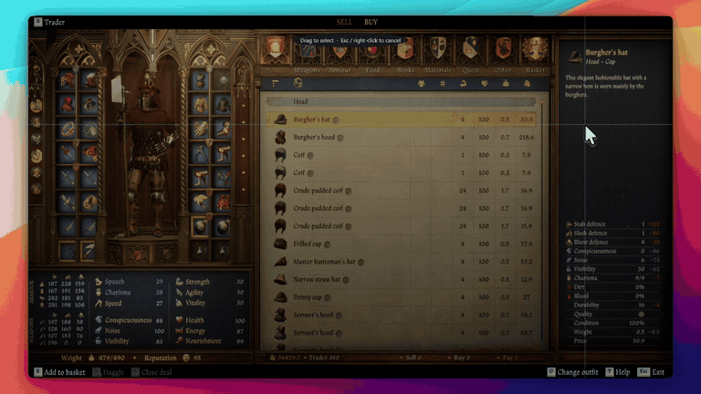

<div align="center">


# ScreenTextCopy

**Grab text from anywhere on your Windows screen — then copy, translate, or send it to your phone.**

Error dialogs that won't let you select text. Text baked into an image. Subtitles in a video.
A PDF viewer that fights you. **ScreenTextCopy reads it all locally.**

[](https://github.com/rezakazemifathi/ScreenTextCopy/actions/workflows/build.yml)
[](https://github.com/rezakazemifathi/ScreenTextCopy/releases/latest)
[](https://github.com/rezakazemifathi/ScreenTextCopy/releases)
[](LICENSE)
[](https://dotnet.microsoft.com/)
[](#requirements)

**English** · [فارسی](README.fa.md) · [العربية](README.ar.md)

### ⬇️ [Download the latest release](https://github.com/rezakazemifathi/ScreenTextCopy/releases/latest)

**No prerequisites. No separate .NET install. No separate Tesseract install. One installer, one click.**

</div>

---

## 🎬 See ScreenTextCopy in action



> **Note:** Add the application screenshots below to `docs/assets/` using the filenames shown in this README. The README is already prepared for them.

## 📸 Screenshots

### Select text from anywhere


### OCR result and translation


### Settings and AI provider configuration


### Send recognized text to your phone


---

## ✨ Why it exists

Windows is full of text you cannot copy: an installer error, a scanned invoice, a screenshot,
a game's dialogue, subtitles, or text inside a PDF viewer.

ScreenTextCopy replaces manual retyping with one shortcut:

**Press `Ctrl + Shift + X` → select an area → the text is recognized and copied to your clipboard.**

OCR runs locally on your computer, so the screen capture itself does not need to leave your device.

## 🚀 Features

| Feature | Description |
|---|---|
| 🖱️ **Capture anything** | Drag a box over any part of your screen, across windows and monitors. |
| 🔒 **Offline OCR** | Tesseract OCR is bundled with the release build. Screen captures are processed locally. |
| 📋 **Auto-copy** | Recognized text is automatically copied to the clipboard. |
| 🌍 **Multiple OCR languages** | English, Persian and Arabic are bundled; additional languages can be installed from Settings. |
| 🔤 **Mixed scripts** | Persian + English text can be recognized together with RTL/LTR handling. |
| 🌐 **Translation** | Translate recognized text using the built-in free provider or an OpenAI-compatible AI endpoint. |
| 🎮 **Overlay translation** | `Ctrl + Shift + Z` shows a floating translation panel next to the selected area. |
| 🔁 **Automatic model failover** | If an AI model times out, another configured model can be tried automatically. |
| 🌐 **Proxy support** | System proxy, direct connection, or manual HTTP/HTTPS/SOCKS proxy. |
| 📱 **Send to phone** | Generate a local QR code and scan it with your phone. No account or upload is required. |
| ⌨️ **Global hotkeys** | Shortcuts can be changed from Settings. |
| 🎨 **Dark & light themes** | Follows Windows by default, with manual theme support. |
| 🇬🇧 🇮🇷 **Bilingual UI** | English and Persian UI with RTL support. |
| 🪟 **System tray** | Closing the main window keeps the application available in the Windows tray. |

---

## 📥 Install

### Recommended — Windows installer

1. Open the **[latest release](https://github.com/rezakazemifathi/ScreenTextCopy/releases/latest)**.
2. Download:
   `ScreenTextCopy-Setup-<version>-win-x64.exe`
3. Run the installer.
4. If Windows SmartScreen appears because the application is not code-signed, select:
   **More info → Run anyway**
5. Finish the installation wizard.

There is nothing else to install. The release package includes the required .NET runtime
and Tesseract OCR components.

### Portable version

If you do not want to install the application:

1. Download:
   `ScreenTextCopy-<version>-win-x64-portable.zip`
2. Extract the ZIP file.
3. Run `ScreenTextCopy.exe`.

---

## ⚡ Quick start

### Copy text from anywhere

1. Press **`Ctrl + Shift + X`**.
2. The screen dims and the cursor becomes a crosshair.
3. Drag around the text you want.
4. Release the mouse button.
5. ScreenTextCopy performs OCR locally.
6. The recognized text is copied to your clipboard automatically.

### Translate text

After OCR finishes:

1. Select the target language.
2. Click **Translate**.
3. The translated text appears in the application.

### Translate inside games and videos

Press **`Ctrl + Shift + Z`** and select the text area.

The translation appears in a floating panel near the selected region.

---

## 🤖 Translation & AI providers

ScreenTextCopy supports a free translation provider and custom OpenAI-compatible endpoints.

| | Free provider | Custom AI |
|---|---|---|
| API key | Not required | Your API key |
| Endpoint | Built-in | Any OpenAI-compatible endpoint |
| Model selection | Automatic | Manual / discovered from provider |
| Best for | Short everyday translations | Better quality, long text, context and AI workflows |

Compatible services can include OpenAI-compatible APIs such as OpenAI, OpenRouter, Groq,
DeepSeek, Together, Azure OpenAI, Ollama, LM Studio, vLLM and similar providers.

For a custom provider, enter:

- **Base URL**
- **API key** (if required)
- **Model**

Then use **Test connection** to verify the endpoint.

### Automatic model failover

If enabled, a timed-out model can be followed by another configured model.

Authentication errors such as **401/403** are not treated as transient timeouts, so the app does
not repeatedly retry an invalid API key across every model.

> Your API key is stored locally in `%AppData%\ScreenTextCopy\settings.json`.
> It is not intentionally logged or displayed in error messages and is sent only to the endpoint
> you configure.

---

## 🌐 Network & proxy

If an AI endpoint cannot be reached, check:

**Settings → Translation → Network**

Available modes:

| Mode | Description |
|---|---|
| **System proxy** | Uses the Windows system proxy. |
| **Direct** | Ignores the system proxy. Useful when a stale proxy is configured. |
| **Manual** | Uses a proxy address you specify, such as `socks5://127.0.0.1:10808`. |

Network settings are applied to subsequent requests without requiring an application restart.

---

## 🔒 Privacy

ScreenTextCopy is designed around local OCR.

- **OCR is local.** Screen captures used for OCR are processed on your computer.
- **QR transfer is local.** The QR code is generated locally; the recognized text is not uploaded to a server.
- **No account is required.**
- **No telemetry or analytics are intentionally included.**
- When you use translation, the text you explicitly submit is sent to the provider you selected.
- Additional OCR language packs may be downloaded when you choose to install them.

For the exact implementation and third-party components, see the project source and
`THIRD-PARTY-NOTICES.md`.

---

## 💻 Requirements

### To run

- Windows 10 (1809+) or Windows 11
- 64-bit Windows
- No separate .NET runtime required for the published self-contained release
- No separate Tesseract installation required for the release package

### To build

- .NET 8 SDK
- Inno Setup 6 — only when creating the Windows installer

---

## 🛠️ Build from source

```powershell
git clone https://github.com/rezakazemifathi/ScreenTextCopy.git
cd ScreenTextCopy

powershell -ExecutionPolicy Bypass -File scripts\fetch-tesseract.ps1

dotnet run --project src\ScreenTextCopy\ScreenTextCopy.csproj
```

### Create release artifacts

```powershell
powershell -ExecutionPolicy Bypass -File scripts\build-release.ps1 -Version 2.0.0
```

The script creates:

```text
release\
├── app\
├── ScreenTextCopy-2.0.0-win-x64-portable.zip
├── ScreenTextCopy-Setup-2.0.0-win-x64.exe
└── SHA256SUMS.txt
```

The installer requires **Inno Setup 6**.

---

## 📦 Publishing a GitHub Release

The **Download the latest release** button and release badges only work correctly after at least
one GitHub Release has been published.

For version `2.0.0`:

1. Push your code to GitHub.
2. Run the release build script.
3. Open the repository's **Releases** page.
4. Click **Draft a new release**.
5. Create/select the tag:
   `v2.0.0`
6. Set the release title:
   `ScreenTextCopy v2.0.0`
7. Upload these files from the `release\` folder:
   - `ScreenTextCopy-Setup-2.0.0-win-x64.exe`
   - `ScreenTextCopy-2.0.0-win-x64-portable.zip`
   - `SHA256SUMS.txt`
8. Publish the release.

**Important:** Do not leave the release as a draft. A draft release does not make
`/releases/latest` available to normal visitors.

After publishing, the README's **Download the latest release** link will automatically point
to the latest published release.

---

## 📚 Documentation

| Document | Description |
|---|---|
| [Install guide](docs/INSTALL.md) · [فارسی](docs/INSTALL.fa.md) | Installation from download to first capture |
| [Usage guide](docs/USAGE.md) · [فارسی](docs/USAGE.fa.md) | Features and settings |
| [Troubleshooting](docs/TROUBLESHOOTING.md) · [فارسی](docs/TROUBLESHOOTING.fa.md) | Common errors and fixes |
| [Build guide](docs/BUILD.md) | Building, publishing and packaging |
| [Architecture](docs/architecture.md) | Project architecture |
| [Source map](docs/source-map.md) | Project file map |
| [Development](docs/development.md) | Development workflow |
| [Publishing guide](docs/PUBLISH-TO-GITHUB.fa.md) | Persian GitHub publishing guide |
| [Changelog](CHANGELOG.md) | Version history |

---

## 🧩 Troubleshooting

### `target machine actively refused it (127.0.0.1:10808)`

A local proxy may be unavailable.

Go to:

**Settings → Translation → Network**

Then try **Direct**, or configure your actual proxy address under **Manual**.

### Translation returns the original text

Check that the source and target languages are different.

### Hotkey does nothing

Another application may already be using the shortcut.

Change it from:

**Settings → Global shortcut → Change**

For more issues, see [TROUBLESHOOTING.md](docs/TROUBLESHOOTING.md).

---

## 🤝 Contributing

Issues and pull requests are welcome.

Please read:

- [CONTRIBUTING.md](CONTRIBUTING.md)
- [SECURITY.md](SECURITY.md)

---

## 📄 License

This project is licensed under the **MIT License**.

Third-party components retain their respective licenses. See
[THIRD-PARTY-NOTICES.md](THIRD-PARTY-NOTICES.md).

---

## 👨‍💻 Author & support

Built by **Reza Kazemi Fathi**.

- [GitHub](https://github.com/rezakazemifathi)
- [Instagram](https://instagram.com/rkfcode)
- [YouTube](https://youtube.com/rkfcode)

If ScreenTextCopy saves you time, consider giving the repository a ⭐.

Support the project:

- [Daramet](https://daramet.com/RKFi)
- [Donatr.ee](https://donatr.ee/rkfcode/)
